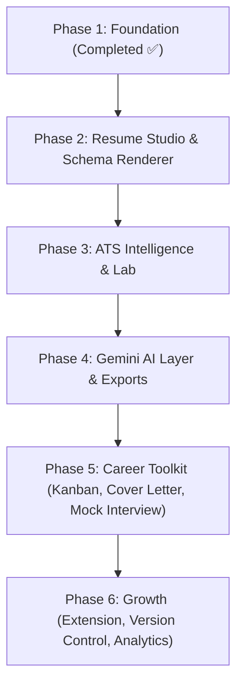

# Enhanced PRD — ResumeForge AI 2.0
### "Canva for Resumes" — Unlimited AI-Powered, ATS-Optimized Resume Builder

---

## 1. Vision & Core Value Proposition

**ResumeForge AI 2.0** combines **Canva's template freedom**, **Notion's smoothness**, and **Rezi/Teal's ATS intelligence**, wrapped in a modern Linear/Stripe/Vercel-grade interface tailored for students, software engineers, and ambitious professionals.

### Core Product Loop
$$\text{User Enters Profile Data Once} \longrightarrow \text{AI Builds Master Profile} \longrightarrow \text{Select / Remix Any Template} \longrightarrow \text{ATS Score + AI Optimization} \longrightarrow \text{Instant Export}$$

---

## 2. UI/UX Design System & Key Screens

### 2.1 Design Language
- **Aesthetic**: Glassmorphism, subtle borders, soft card glows, 8pt spacing grid, responsive layout.
- **Motion**: Framer Motion micro-interactions — fade+slide page transitions, staggered reveals, skeleton-to-content morphs.
- **Typography**: Inter / Plus Jakarta Sans with fluid scaling (`clamp()`).
- **Color System**: Dark Mode default (`#020617`), accent gradients (`indigo → violet → pink`), semantic ATS status indicators (emerald for >90%, amber for 75-89%, rose for <75%).
- **Command Palette (`⌘K` / `Ctrl+K`)**: Instant shortcut menu to jump between templates, sections, and AI generation tasks.

### 2.2 Key Screens Breakdown

| Screen | Purpose & Specifications |
|---|---|
| **Onboarding Wizard** | 60-second conversational step card flow with progress ring for quick initial data capture. |
| **Resume Studio** | Split view: left = form editor / AI prompt box, right = **live WYSIWYG preview engine** with zoom and page-break guides. |
| **Template Gallery** | Masonry layout, filtered by industry/ATS-score/style, hover preview animations, and AI role-based recommendations. |
| **ATS Lab** | Job Description paste input with side-by-side keyword match, missing skills heatmap, and parseability analysis. |
| **Dashboard** | Resume version cards, Application Tracker Kanban board, score trend analytics graphs. |
| **Career Toolkit** | Cover Letter Generator, Mock Interview AI, LinkedIn Headline Optimizer, Portfolio Link Generator. |

### 2.3 Accessibility & Performance
- WCAG 2.1 AA contrast compliance, keyboard shortcuts (`Tab`, `⌘K`, `Esc`).
- Virtualized lists for smooth template gallery rendering.
- Code splitting via Vite dynamic imports targeting Lighthouse > 95.

---

## 3. Unlimited Schema-Driven Template Engine

Unlike traditional static PDF builders, ResumeForge AI 2.0 decouples layout presentation from content using **JSON Layout Schemas**.

### 3.1 Schema Architecture
```json
{
  "templateId": "modern-minimal-01",
  "atsScore": 96,
  "layout": "single-column | two-column | sidebar",
  "sections": ["header", "summary", "experience", "skills", "education", "projects"],
  "theme": {
    "font": "Inter",
    "accent": "#6366F1",
    "density": "compact | comfortable"
  }
}
```
- **Universal Render Engine**: A single React component tree dynamically renders any schema, supporting unlimited theme variations, font swaps, and section orderings without code changes.
- **AI Template Remixing**: Users can prompt AI ("Clean 2-column layout for Fintech PM") to generate layout schemas dynamically.

### 3.2 ATS Safety Guardrails
Every template schema is run through an **ATS Compliance Linter** prior to publication:
- ❌ No text inside embedded images.
- ❌ No multi-column parsing traps or nested HTML tables for critical data.
- ✅ Standard headings, clear semantic hierarchy, and embedded system fonts.
- Real-time `ATS Score: 98/100` badge automatically verified.

---

## 4. AI Resume Generation & Optimization Engine

1. **Single Source of Truth (Master Profile)**: User profile details stored centrally in Firestore independent of templates.
2. **Role-Aware Tailoring**: Pasting a target Job Description invokes Google Gemini to produce a tailored version (re-ordering bullets, injecting key terms, adjusting summary).
3. **Bullet Point Enhancer (XYZ Formula)**: Rewrites weak bullets following Google's XYZ formula (*"Accomplished X by doing Y, measured by Z"*).
4. **Multi-Template Fan-out**: Instantly render tailored content across all templates with zero re-entry.
5. **Real-time Live Score**: Real-time 0–100 score gauge tracking ATS parseability, keyword density, and impact metric density.

---

## 5. Student & Job-Seeker Features

| Feature | Description |
|---|---|
| **Cover Letter AI Generator** | Auto-drafts matching, tailored cover letters from resume data and target Job Descriptions. |
| **LinkedIn Headline & About Optimizer** | Converts resume bullets into high-converting LinkedIn profile sections. |
| **Application Tracker (Kanban)** | Track application statuses (*Applied → Interview → Offer → Rejected*) linked to specific resume versions. |
| **Mock Interview AI** | Role-specific practice Q&A with instant AI feedback using Gemini. |
| **Skill Gap Analyzer** | Identifies missing technical skills between candidate resume and target Job Description. |
| **Campus / Fresher Mode** | Specialized builder mode emphasizing coursework, projects, hackathons, and certifications over work history. |
| **Portfolio Page Generator** | Generates a shareable web portfolio link from the user's Master Profile. |
| **Resume Version Control** | Git-like version history to branch and revert resume variations. |

---

## 6. Updated Phase Roadmap



### Phase 1 — Foundation Setup (COMPLETED ✅)
- React 19 + TypeScript + Vite + Tailwind CSS v4 + Framer Motion.
- Firebase Auth (Email/Password, Google OAuth, Password Reset, Verification).
- Route Guards, Theme System (Dark/Light), UI Component Set, Dashboard & Landing Page layout.

### Phase 2 — Resume Studio Core
- Master Profile Firestore schema + step-by-step onboarding builder with auto-save.
- Live WYSIWYG preview engine (schema-driven renderer).
- Template gallery (JSON-schema based).
- Drag-and-drop section reordering.

### Phase 3 — ATS Intelligence & Lab
- Job Description parser (text & URL).
- Side-by-side keyword match diff + ATS compliance linter.
- Real-time Resume Score gauge.

### Phase 4 — Gemini AI Layer
- Bullet point enhancer (XYZ formula).
- Role-aware full tailoring from Job Descriptions.
- Cover Letter AI generator.
- PDF / DOCX export service with pixel preview parity.

### Phase 5 — Career Toolkit
- Application Tracker (Kanban board).
- Mock Interview AI with feedback.
- Skill Gap Analyzer & LinkedIn Optimizer.
- Portfolio Page Generator.

### Phase 6 — Growth & Extension
- Chrome Extension for 1-click job post capturing.
- Resume Version Control & branching.
- Gamified resume scores, badges, and salary insights.

---

## 7. Data Schemas (Firestore)

### Collection: `masterProfiles`
```json
{
  "userId": "string",
  "personalInfo": {
    "fullName": "string",
    "email": "string",
    "phone": "string",
    "location": "string",
    "linkedin": "string",
    "github": "string",
    "portfolio": "string"
  },
  "experience": [
    {
      "id": "string",
      "company": "string",
      "position": "string",
      "startDate": "string",
      "endDate": "string",
      "current": "boolean",
      "bullets": ["string"]
    }
  ],
  "education": [],
  "projects": [],
  "skills": ["string"],
  "certifications": [],
  "updatedAt": "timestamp"
}
```

### Collection: `applications` (Kanban Tracker)
```json
{
  "id": "string",
  "userId": "string",
  "company": "string",
  "role": "string",
  "status": "applied | interview | offer | rejected",
  "resumeVersionId": "string",
  "jobUrl": "string",
  "appliedAt": "timestamp"
}
```

### Collection: `templates`
```json
{
  "templateId": "string",
  "title": "string",
  "layoutSchema": "object",
  "atsScore": "number",
  "isAIRemix": "boolean",
  "createdBy": "system | userId"
}
```

---

## 8. Target KPIs & Success Metrics

- **Lighthouse Performance Score**: > 95 across Desktop and Mobile.
- **Conversion Rate**: > 15% from Landing Page to Sign-up.
- **ATS Average Score**: Generated resumes average > 90% ATS match score.
- **Template Scalability**: 50+ base templates + infinite AI remixes.
- **Career Feature Engagement**: > 30% active usage of Mock Interview & Skill Gap features.
- **Weekly Active Users**: > 25% weekly active usage on Application Kanban Tracker.
